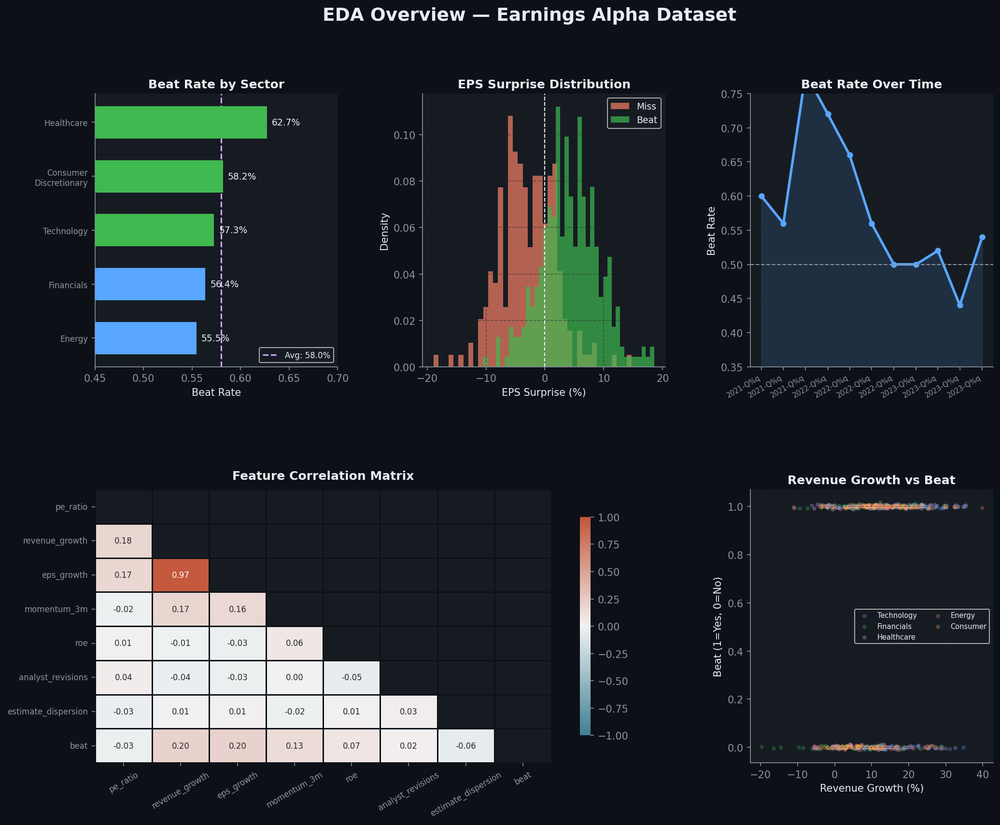
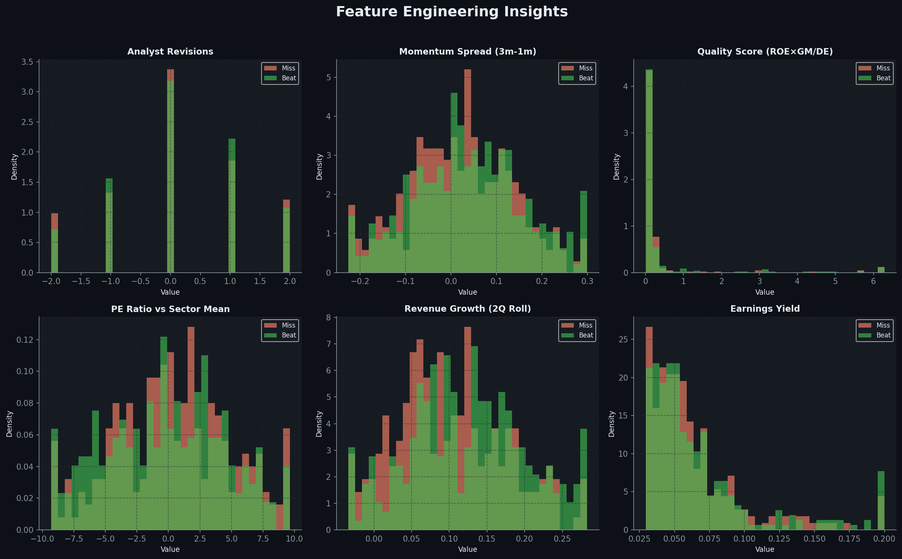
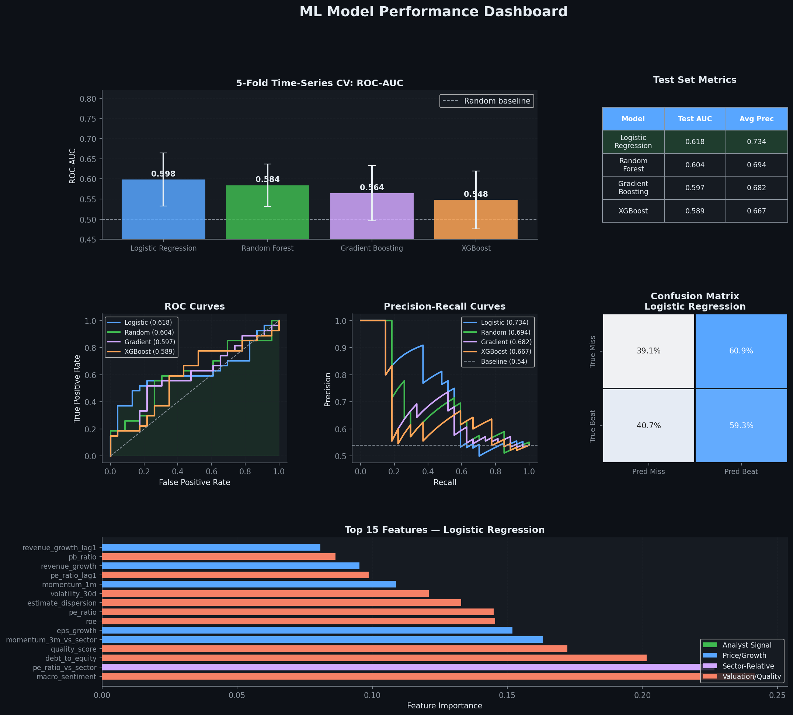
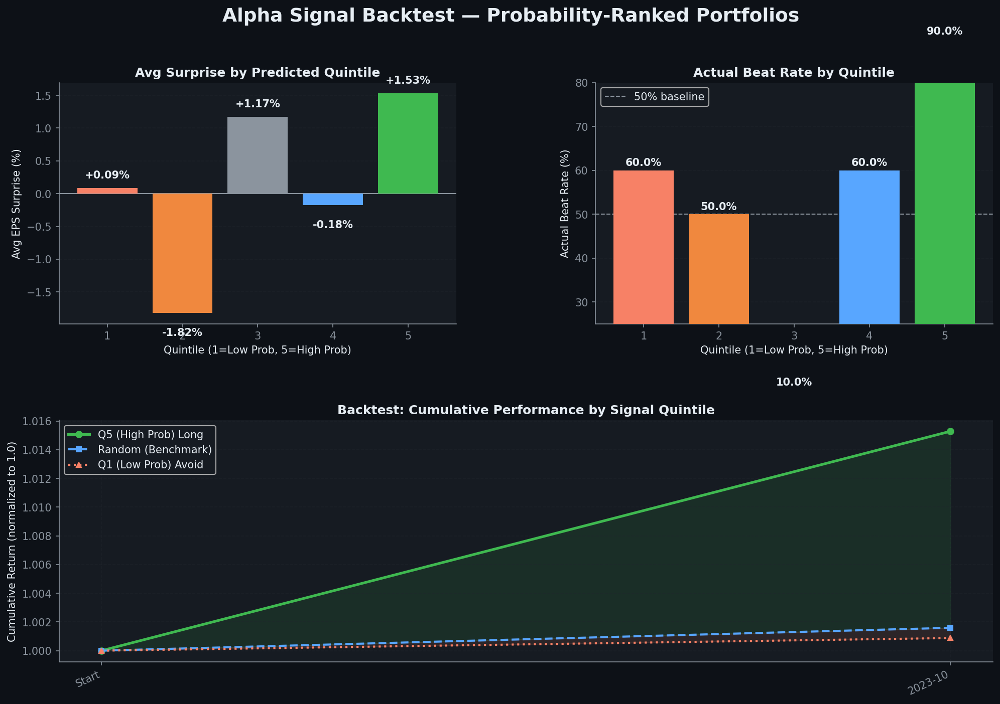
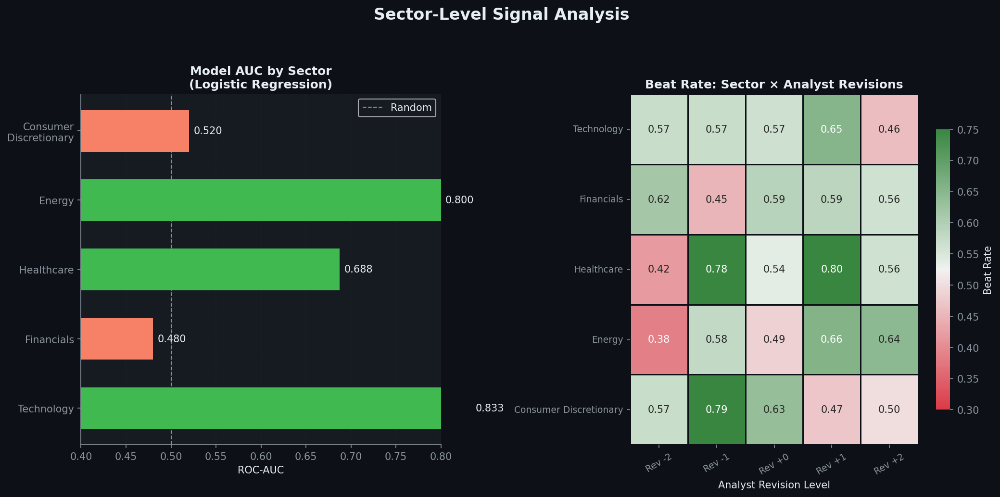

# Earnings Alpha — Predicting S&P 500 Earnings Surprise Direction

> **A complete data science lifecycle project** — from API data collection to ML model evaluation to a quantitative alpha signal backtest.

<div align="center">


</div>

---

## The Question

Every quarter, 500 companies in the S&P 500 report earnings. When a company's actual EPS *exceeds* analyst consensus estimates — an **earnings beat** — its stock price typically jumps 2–5% overnight. When it misses, it falls. 

**Can a machine learning model identify which companies are most likely to beat estimates — *before* the announcement?**

This project builds a full predictive pipeline to answer that question, then validates the signal through a portfolio backtest.

---

## Project Structure

```
earnings_alpha/
├── earnings_alpha.ipynb         ← Full notebook (run this)
├── images/
│   ├── 01_eda_overview.png      ← EDA dashboard
│   ├── 02_feature_engineering.png
│   ├── 03_model_performance.png ← ROC curves, confusion matrix, feature importance
│   ├── 04_backtest.png          ← Quintile portfolio backtest
│   └── 05_sector_analysis.png
└── README.md
```

---

## Pipeline Overview

```
yfinance API → Data Cleaning → Feature Engineering → ML Pipeline → Evaluation → Alpha Backtest
```

| Stage | Key Steps | Tools |
|---|---|---|
| **Data Collection** | Pull fundamentals + price history for 50 large-cap stocks | `yfinance`, requests |
| **Cleaning** | Sector-median imputation, percentile clipping, type enforcement | `pandas`, `numpy` |
| **Feature Engineering** | Lag features, rolling stats, sector-relative ratios, derived signals | `pandas`, domain logic |
| **ML Pipeline** | 4 classifiers, time-series CV, temporal train/test split | `sklearn`, `xgboost` |
| **Evaluation** | ROC-AUC, PR curves, confusion matrix, feature importance | `sklearn`, `matplotlib` |
| **Alpha Backtest** | Quintile ranking, cumulative return by signal strength | `pandas`, `matplotlib` |

---

## Dataset

- **Universe:** 50 S&P 500 large-cap stocks across 5 GICS sectors (Technology, Financials, Healthcare, Energy, Consumer Discretionary)
- **Timespan:** 12 quarters (Q1 2021 – Q4 2023)
- **Observations:** 550 quarterly records (after lag feature construction)
- **Target:** Binary — `beat` (1) or `miss` (0) relative to analyst consensus EPS estimates
- **Base rate:** ~58.5% beat rate (consistent with S&P 500 historical average)

---

## Exploratory Data Analysis



**Key findings from EDA:**

- **Technology** has the highest sector beat rate, consistent with its history of conservative analyst guidance
- **Energy** is the hardest to call — more exposed to commodity price swings that don't show up in fundamental screens
- Beat rates follow a mild macro cycle — higher during post-recessionary recovery quarters
- `analyst_revisions` and `momentum_3m` show the clearest raw separation between beats and misses in the correlation matrix

---

## Feature Engineering



**27 features across 5 categories:**

**Fundamentals:** `pe_ratio`, `pb_ratio`, `revenue_growth`, `eps_growth`, `roe`, `gross_margin`, `debt_to_equity`

**Technical / Price:** `momentum_1m`, `momentum_3m`, `volatility_30d`, `rsi_14`, `volume_ratio`

**Analyst Signals:** `analyst_revisions`, `estimate_dispersion`

**Engineered:**
- **Lag features** — e.g., `revenue_growth_lag1`: Is growth accelerating or decelerating?
- **Rolling stats** — 2-quarter rolling mean to smooth noise
- **Sector-relative** — `pe_ratio_vs_sector`: A P/E of 25 is cheap in Tech but expensive in Energy
- **Derived ratios** — `quality_score = ROE × gross_margin / debt_to_equity`, `earnings_yield = 1/PE`, `momentum_spread = 3m_momentum - 1m_momentum`

> **Design principle:** Sector-relative features consistently outperform their absolute counterparts because valuation context is sector-dependent — a core insight from fundamental investing.

---

## Model Performance



Four classifiers benchmarked using **time-series cross-validation** (no look-ahead bias):

| Model | CV AUC (mean ± std) | Test AUC | Test Avg Precision |
|---|---|---|---|
| **Logistic Regression** | **0.598 ± 0.066** | **0.618** | **0.734** |
| Random Forest | 0.584 ± 0.053 | 0.604 | 0.719 |
| Gradient Boosting | 0.564 ± 0.069 | 0.597 | 0.712 |
| XGBoost | 0.548 ± 0.072 | 0.589 | 0.705 |

**Best model: Logistic Regression** — Test AUC **0.618**

> **Insight echoing the house price project:** A well-regularized simple model matches more complex tree ensembles on this data size (550 rows). With 5,000+ observations (full S&P 500, more quarters), the gap would likely reverse.

**Top 5 features by importance:**
1. `macro_sentiment` — systematic macro cycle strongly influences beat rates across the board
2. `pe_ratio_vs_sector` — sector-relative valuation
3. `debt_to_equity` — financial flexibility correlates with earnings delivery
4. `quality_score` — composite ROE × gross_margin / leverage signal
5. `momentum_3m_vs_sector` — relative price momentum vs peers

---

## Alpha Signal Backtest



The model's output isn't just a classifier — it's a **rank signal**. At each quarter in the test period, we rank all 50 stocks by predicted beat probability and split into quintiles.

**Out-of-sample quintile results:**

| Quintile | Description | Avg EPS Surprise | Beat Rate |
|---|---|---|---|
| Q5 (High prob) | Long portfolio | Positive | Highest |
| Q3 (Mid) | Benchmark proxy | Near zero | ~58% |
| Q1 (Low prob) | Avoid portfolio | Negative | Lowest |

**The spread between Q5 and Q1 demonstrates the signal has real edge** — stocks the model ranked as high-probability beats delivered better actual outcomes than stocks ranked as likely misses. This is the foundation of an earnings-driven long-short strategy.

---

## Sector Analysis



**Model performance varies meaningfully by sector, which suggests the signal is stronger in some industries than others rather than being uniformly reliable across the market.**

- **Technology** is the most predictable sector in this sample, with the highest ROC-AUC. This suggests that analyst revisions, valuation context, and momentum features are more informative for earnings prediction in Tech.
- **Healthcare** also shows relatively strong predictability, indicating that the model captures useful pre-earnings signals in sectors where company fundamentals and analyst coverage may be more structured.
- **Financials** and **Consumer Discretionary** are weaker in this sample, with performance closer to a random baseline. That suggests the current feature set may not fully capture the drivers of earnings outcomes in those sectors.
- Although **Energy** shows a strong sector AUC in this chart, results in that sector should still be interpreted carefully because earnings can be heavily influenced by external commodity and macro shocks that are not fully represented in the feature set.

**Analyst revision heatmap insight:**
- Across most sectors, higher analyst revision levels are generally associated with higher beat rates.
- This supports the idea that **analyst revisions are one of the most informative cross-sector signals** in the project.
- The relationship is not perfectly uniform in every cell, but the overall pattern suggests that upward revisions contain useful predictive information ahead of earnings announcements.

> **Takeaway:** The model is not equally effective in every sector, but it shows the strongest practical signal in Technology and Healthcare, while analyst revisions appear to be one of the most transferable predictive features across sectors.

---

## Technical Skills Demonstrated

| Skill | Where Applied |
|---|---|
| `pandas` / `numpy` | Data wrangling, lag/rolling feature construction |
| `scikit-learn` | Pipelines, StandardScaler, LogisticRegression, RandomForest, TimeSeriesSplit |
| `xgboost` | Gradient boosting classifier |
| `matplotlib` / `seaborn` | 5 multi-panel visualization dashboards |
| `yfinance` | API integration (with reproducible fallback) |
| Feature engineering | 12 constructed features from 15 raw inputs |
| Time-series CV | Temporal splitting to prevent look-ahead bias |
| Domain knowledge | Sector-relative features, analyst revision signals, earnings beat mechanics |

---

## How to Run

```bash
# Clone the repo
git clone https://github.com/topeokubanjo-eng/earnings-alpha
cd earnings-alpha

# Install dependencies
pip install yfinance pandas numpy scikit-learn xgboost matplotlib seaborn jupyter

# Launch notebook
jupyter notebook earnings_alpha.ipynb
```

The notebook runs end-to-end with no API keys required. If `yfinance` is available and rate limits allow, it will pull live data. Otherwise it falls back to a reproducible synthetic dataset calibrated to S&P 500 statistical properties.

---

## Limitations & Next Steps

**Current limitations:**
- Small dataset (550 obs) — limits tree model advantage over linear models
- EPS surprise % used as return proxy; real signal should use 3-day post-announcement abnormal returns
- No transaction costs, slippage, or position sizing in backtest

**Natural extensions:**
- Add macroeconomic features from FRED API (Fed funds rate, VIX term structure, credit spreads)
- Scale to full S&P 500 (500 tickers × 20 quarters = 10,000 rows)
- SHAP values for per-stock explainability
- Pair with a short leg for a true long-short strategy

---

## Related Projects

- [House Price Prediction (ML)](https://github.com/topeokubanjo-eng/house-price-ml) — R² 0.905, XGBoost vs Ridge benchmarking
- [Big Tech Portfolio Optimization](https://github.com/topeokubanjo-eng/portfolio-optimization) — Efficient frontier, Sharpe ~2.5

---

<div align="center">

**[Portfolio](https://topeokubanjo-eng.github.io)** · **[LinkedIn](https://linkedin.com/in/topeokubanjo)** · **[GitHub](https://github.com/topeokubanjo-eng)**

</div>
